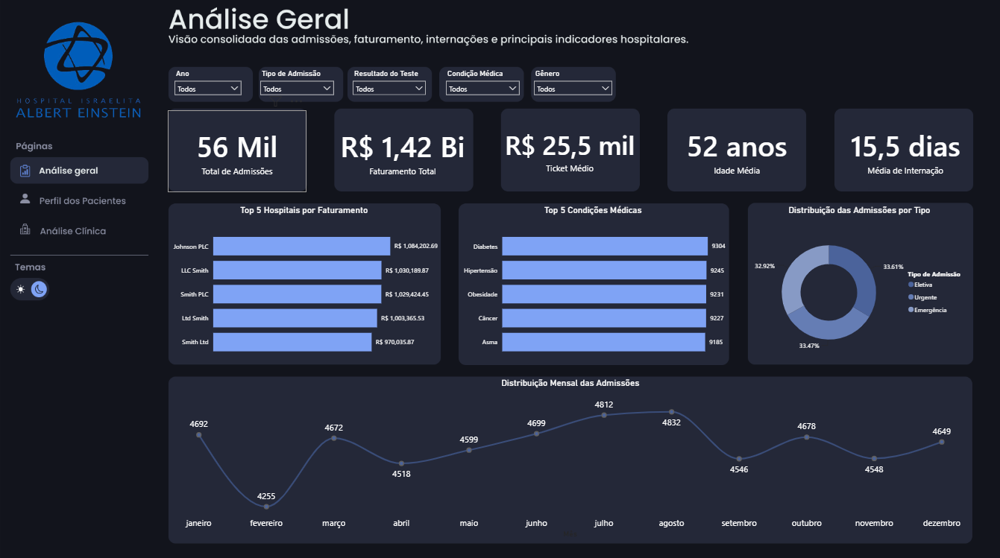
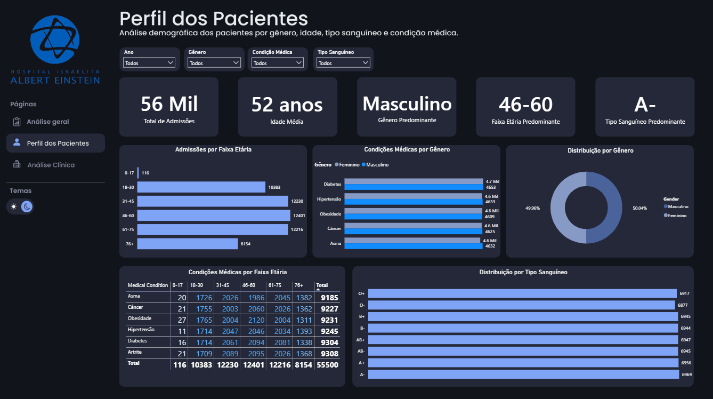
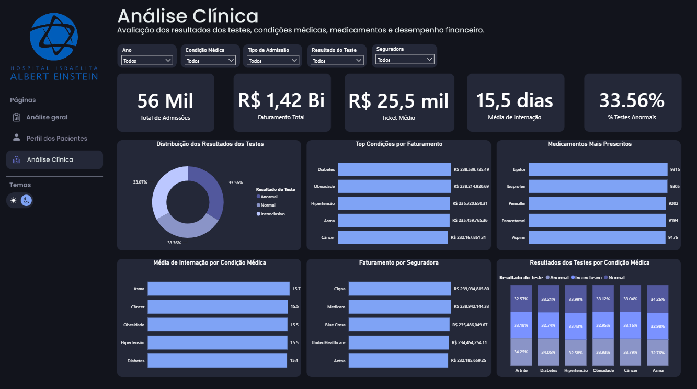

# Dashboard de Análise Hospitalar

## Sobre o projeto

Este projeto consiste em um dashboard de análise hospitalar desenvolvido em Power BI, utilizando uma base sintética de saúde obtida no Kaggle.

A base não contém dados reais de pacientes e foi utilizada apenas para fins de estudo, prática e construção de portfólio em análise de dados.

## Objetivo

O objetivo do projeto foi analisar admissões hospitalares, faturamento, perfil dos pacientes, condições médicas, medicamentos e resultados de testes clínicos.

O dashboard foi dividido em três páginas principais:

1. Análise Geral
2. Perfil dos Pacientes
3. Análise Clínica

## Ferramentas utilizadas

- Power BI
- Power Query
- DAX
- Figma
- Kaggle

## Indicadores analisados

- Total de admissões
- Faturamento total
- Ticket médio
- Idade média dos pacientes
- Média de dias de internação
- Distribuição por gênero
- Distribuição por faixa etária
- Distribuição por tipo sanguíneo
- Condições médicas mais frequentes
- Medicamentos mais prescritos
- Resultados dos testes
- Faturamento por seguradora

## Principais resultados

- Total de admissões: aproximadamente 56 mil
- Faturamento total: aproximadamente R$ 1,42 bi
- Ticket médio: aproximadamente R$ 25,5 mil
- Idade média dos pacientes: 52 anos
- Média de internação: 15,5 dias
- Percentual de testes anormais: 33,56%

## Páginas do dashboard

### 1. Análise Geral

Esta página apresenta uma visão consolidada dos principais indicadores hospitalares, como admissões, faturamento, ticket médio, idade média, média de internação, principais condições médicas e distribuição mensal das admissões.

### 2. Perfil dos Pacientes

Esta página apresenta uma análise demográfica dos pacientes, considerando idade, gênero, faixa etária, tipo sanguíneo e condição médica.

### 3. Análise Clínica

Esta página apresenta uma visão clínica e financeira, analisando resultados dos testes, medicamentos mais prescritos, faturamento por condição médica, média de internação e faturamento por seguradora.

## Principais insights

- A base possui aproximadamente 56 mil admissões hospitalares.
- O faturamento total analisado foi de aproximadamente R$ 1,42 bilhão.
- O ticket médio por admissão ficou em torno de R$ 25,5 mil.
- A idade média dos pacientes foi de aproximadamente 52 anos.
- O tempo médio de internação foi de 15,5 dias.
- A distribuição por gênero ficou praticamente equilibrada.
- A faixa etária predominante foi de 46 a 60 anos.
- As condições médicas mais frequentes foram Diabetes, Hipertensão, Obesidade, Câncer e Asma.
- Cerca de 33,56% dos resultados dos testes foram classificados como anormais.
- Os medicamentos mais prescritos foram Lipitor, Ibuprofeno, Penicilina, Paracetamol e Aspirina.

## Fonte dos dados

Base sintética de saúde obtida no Kaggle.

Observação: os dados são sintéticos e não representam pacientes reais.

## Aprendizados

Com este projeto, pratiquei:

- Tratamento de dados no Power Query
- Criação de medidas DAX
- Construção de KPIs
- Desenvolvimento de dashboards interativos
- Organização visual com apoio do Figma
- Storytelling com dados
- Análise exploratória em contexto hospitalar
